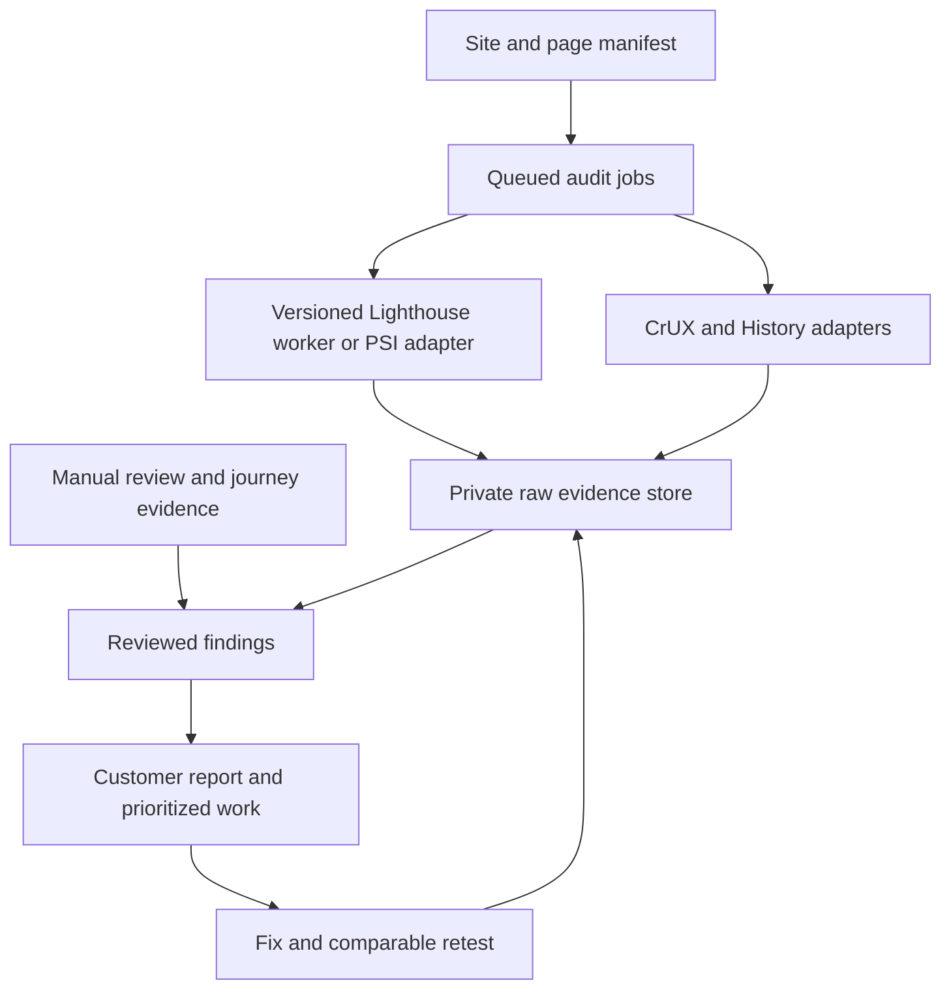

# Lighthouse research and audit playbook for MindLeverX

**Checked: 23 September 2026.** Research and proposed operating method for our website, applications and customer audits. No live website audit, product integration, customer report, scheduled monitoring or deployment was performed in this research task.

## 1. What we should build around this

**Recommendation:** Use Lighthouse as the automated lab-testing component of an evidence-backed website improvement service. Combine it with real-user performance, manual accessibility and journey checks, and search evidence. Preserve findings at page and issue level so we can explain a problem, fix it and verify the result.

The strongest service hypothesis is a recurring cycle: baseline → prioritized changes → verified fixes → regression monitoring. Its commercial value, review effort and margins remain to be tested. The defensible customer deliverable is a specific improvement record with evidence, scope and remaining gaps.

This package includes:

- [Complete default audit inventory](lighthouse-audit-inventory.md): 165 category references, representing **162 unique audit IDs** in Lighthouse 13.5.0.
- [Machine-readable inventory](lighthouse-audit-inventory.json): IDs, categories, configured weights and pinned implementation links.
- [Evidence and reporting specification](lighthouse-evidence-spec.md): fields to collect, result handling, issue records and customer report template.
- [Source and verification register](lighthouse-source-register.md): official sources, dates, scope and implementation implications.

**Evidence labels used here:** “Documented” means an official source describes the behavior; “source-verified” means the pinned implementation was inspected; “proposed” means our operating choice, not a Google requirement; “unvalidated” means it requires a pilot or live measurement.

## 2. Version findings that change the plan

**Source-verified:** The latest GitHub release observed was **13.5.0**, published September 18, 2026. Its package requires Node ≥22.19. The release says Chrome 156 and PageSpeed Insights rollout are expected within two weeks; that is not evidence those channels already run this version. Record the actual version from every report. [Release](https://github.com/GoogleChrome/lighthouse/releases/tag/v13.5.0), [package](https://github.com/GoogleChrome/lighthouse/blob/v13.5.0/package.json).

The default configuration contains five categories: Performance, Accessibility, Best Practices, SEO and experimental Agentic Browsing. Some overview/README material still describes four. Category selection, available browser features and gathering mode determine what actually executes. Our inventory reflects the source configuration, not a guarantee that every check runs on every page. [Default configuration](https://github.com/GoogleChrome/lighthouse/blob/v13.5.0/core/config/default-config.js).

There are 50 Performance references, 76 Accessibility, 21 Best Practices, 11 SEO and seven Agentic Browsing. Three IDs appear in two categories. These totals include manual prompts, hidden diagnostics, unscored and inapplicable checks. **Do not market them as 162 independent automated tests executed on every page.** The inventory extraction verified every ID against an existing source file.

## 3. The measurement system

| Evidence | Best use | Meaning and boundary |
| --- | --- | --- |
| Lighthouse lab run | Reproduce a load and diagnose code/resource problems | One page/state under recorded conditions; not a population measurement |
| CrUX API | Real-user performance baseline | Eligible Chrome experiences, URL or origin, trailing 28 days |
| CrUX History API | Trends before and after changes | Up to 40 weekly observations of overlapping 28-day windows |
| Our own real-user monitoring (RUM) | Attribute problems to actual visits, releases and interactions | Requires instrumentation and our own collection/storage; coverage depends on implementation |
| Manual accessibility and journey review | Keyboard, focus, content meaning, assistive technology and task completion | Human evidence for the tested scope |
| Search Console and search-specific checks | Indexing, search performance and search appearance | Separate from Lighthouse SEO eligibility checks |
| Business analytics | Leads, conversions and completed tasks | Separate outcome data; a speed improvement alone does not prove revenue lift |

Google's PageSpeed Insights combines lab and field information where available. Its API documentation now says the CrUX portion will be discontinued and recommends direct CrUX APIs; the checked page gives no removal date. **Proposed architecture: separate lab and field adapters from the start.** [PSI guide](https://developers.google.com/speed/docs/insights/v5/get-started), [PSI interpretation](https://developers.google.com/speed/docs/insights/v5/about).

### Core Web Vitals

The good thresholds are **LCP ≤2.5 seconds**, **INP ≤200 milliseconds**, and **CLS ≤0.1**, evaluated at the 75th percentile for field reporting. Store device class, period and URL/origin scope alongside them. Preserve provider assessment and missing-metric states rather than inventing a pass. PSI documents a special case where INP is unavailable and assessment uses the other two metrics. [PSI interpretation](https://developers.google.com/speed/docs/insights/v5/about).

Google recommends good Core Web Vitals for user experience and Search. They do not establish that a page will rank well. Our customer copy should describe measured performance and technical findings without promising rankings. [Google Search guidance](https://developers.google.com/search/docs/appearance/core-web-vitals).

CrUX coverage is selective: opted-in Chrome desktop/Android users, sufficiently popular and eligible pages/origins. It excludes Chrome on iOS, Android WebViews and other Chromium browsers. URL query strings and fragments are removed; SPA activity may be attributed to the initial page view. Missing data is not a failing score. CrUX does not expose customer traffic totals. Attribute reused CrUX data to Google under its documented CC BY 4.0 license. [Methodology](https://developer.chrome.com/docs/crux/methodology).

## 4. What we can extract from Lighthouse

### Performance: diagnosis beyond the score

The normal navigation score weights are TBT 30%, LCP 25%, CLS 25%, FCP 10% and Speed Index 10%. The score is a nonlinear transformation of metrics, not a percentage of users having a good experience. Diagnostic findings can matter even when their scoring weight is zero. [Scoring](https://developer.chrome.com/docs/lighthouse/performance/performance-scoring), [versioned configuration](https://github.com/GoogleChrome/lighthouse/blob/v13.5.0/core/config/default-config.js).

Capture these families:

- **Loading:** document latency, redirects, server response, LCP breakdown and resource discovery, render-blocking resources, dependency chains and HTTP delivery.
- **Payload:** image delivery, font display, compression/minification opportunities, unused/duplicated/legacy JavaScript, CSS, caching and transfer sizes.
- **Execution:** long tasks, script startup, main-thread work, forced reflow, DOM size and third-party contribution.
- **Stability:** layout-shift sources, missing dimensions, non-composited animations and related nodes.
- **Supporting evidence:** network request records, resource summaries, script treemaps, user timings, filmstrip, final screenshot and optional full-page screenshot.

These map to the inventory's insight and diagnostic IDs. Estimated savings are model outputs; several findings can overlap. Do not add every estimate together or present the sum as a guaranteed speedup. Verify an implemented change with another comparable run. [Audit result model](https://github.com/GoogleChrome/lighthouse/blob/v13.5.0/types/lhr/audit-result.d.ts).

**INP nuance:** A standard navigation performance score uses TBT. Lighthouse 13.5.0 can also report lab INP in **timespan mode with non-simulated throttling and actual interactions**. No interaction, or simulated throttling, produces not-applicable in that audit. This remains a controlled interaction measurement, not CrUX field INP. [INP implementation](https://github.com/GoogleChrome/lighthouse/blob/v13.5.0/core/audits/metrics/interaction-to-next-paint.js).

### Accessibility

Capture individual rules and affected elements for accessible names, labels, ARIA, contrast, language, tables/lists, headings and other tested aspects. Preserve manual review items separately. A 100 score cannot certify WCAG conformance; manual items do not contribute to the automated score. [Lighthouse accessibility scoring](https://developer.chrome.com/docs/lighthouse/accessibility/scoring).

**Proposed review complement:** keyboard-only primary journeys; visible focus and focus restoration; menu/dialog operation; screen-reader names and state announcements; form instructions/errors; meaningful alternative text; zoom/reflow; captions; reduced-motion behavior. Map findings to the applicable WCAG criteria before making a conformance claim. Our standing design target is WCAG 2.2 AA, with project-specific scope. W3C explicitly says tools require human judgment and may give misleading results. [W3C evaluation guidance](https://www.w3.org/WAI/test-evaluate/tools/selecting/), [WCAG overview](https://www.w3.org/WAI/standards-guidelines/wcag/).

### Best Practices

The current inventory includes HTTPS and redirect behavior, console/browser issues, permission prompts, image dimensions, deprecated features, cookies, source-map information and several security-header checks. Some security checks have **zero scoring weight**. A perfect category score therefore cannot be called a security clearance. [Configuration](https://github.com/GoogleChrome/lighthouse/blob/v13.5.0/core/config/default-config.js).

**Proposed scope boundary:** application authorization, tenant isolation, session security, dependency vulnerabilities, payments and data handling need their own verification. A Lighthouse report cannot establish these properties. Apply the project's separate security requirements to those areas.

### SEO

The default references cover crawlability, title, description, response status, link text, crawlable anchors, robots.txt, image alternatives, hreflang and canonical declarations, plus a manual structured-data item. They are **not all equally weighted** in 13.5.0: `is-crawlable` has a higher configured weight. [SEO configuration](https://github.com/GoogleChrome/lighthouse/blob/v13.5.0/core/config/default-config.js).

**Proposed companion work:** discover the full URL set; examine indexing and canonical behavior; test applicable structured data; inspect content usefulness and internal navigation; use Search Console for actual search evidence. Keep these findings outside the Lighthouse score. Search Console provides indexing and performance information that an on-page scan cannot supply. [Search Console guide](https://developers.google.com/search/docs/monitor-debug/search-console-start).

## 5. Experimental agentic browsing: useful, with precise claims

Documented as experimental and based on evolving standards, this category uses a fraction-style display. Official guidance specifies Chrome 150+ and origin-trial requirements for WebMCP audits. Availability must be tested in the intended runner. [Agentic scoring](https://developer.chrome.com/docs/lighthouse/agentic-browsing/scoring).

Source inspection adds details we need to preserve in reports:

| Check | What 13.5.0 actually establishes | Reporting treatment |
| --- | --- | --- |
| `agent-accessibility-tree` | A subset of accessibility rules; summary can show only the first affected node for a failed rule | Link to underlying accessibility findings; deduplicate |
| `webmcp-form-coverage` | Unsupported browser/no forms → N/A; all forms annotated → pass; uncovered forms → informative listing | Do not turn every uncovered form into a scored failure |
| `webmcp-registered-tools` | Tool names/descriptions/schemas and sources; informative; warning above 40 tools | Inventory, not a test of tool correctness or successful agent use |
| `webmcp-schema-validity` | Browser-reported WebMCP schema issues; unsupported browser → N/A | Preserve errors/warnings and runtime prerequisites |
| `cumulative-layout-shift` | Existing layout-stability metric | One underlying finding even if shown in two categories |
| `llms-txt` | 4xx response → N/A; server/fetch errors fail; checks basic Markdown structure, link and length | Syntax/availability heuristic, not factual accuracy or visibility evidence |
| `ard-schema` | Validates a discovered `ai-catalog.json`; absence without explicit discovery signal → N/A; advertised but unavailable catalog fails | Applies to adopting sites; not a universal requirement for AI agents |

Implementations: [accessibility tree](https://github.com/GoogleChrome/lighthouse/blob/v13.5.0/core/audits/agentic/agent-accessibility-tree.js), [form coverage](https://github.com/GoogleChrome/lighthouse/blob/v13.5.0/core/audits/webmcp-form-coverage.js), [tools](https://github.com/GoogleChrome/lighthouse/blob/v13.5.0/core/audits/webmcp-registered-tools.js), [schemas](https://github.com/GoogleChrome/lighthouse/blob/v13.5.0/core/audits/webmcp-schema-validity.js), [llms.txt](https://github.com/GoogleChrome/lighthouse/blob/v13.5.0/core/audits/agentic/llms-txt.js), [ARD](https://github.com/GoogleChrome/lighthouse/blob/v13.5.0/core/audits/agentic/ard-schema.js).

**Key business boundary:** These checks do not run a panel of AI agents, prove task success, measure whether ChatGPT recommends a business, or predict citations. Google explicitly says `llms.txt` is not used for Google Search visibility. Treat agent interoperability, search eligibility and observed AI answers as different evidence streams. [Google AI optimization guide](https://developers.google.com/search/docs/fundamentals/ai-optimization-guide).

**Proposed adoption:** Include an experimental appendix when supported. Prioritize semantic interfaces and measured user problems now. Consider WebMCP/ARD implementation when a concrete supported integration or task justifies it; test the actual task before claiming benefit.

## 6. Choose the right collection path

| Path | Good fit | Main tradeoff |
| --- | --- | --- |
| Chrome DevTools | Developer diagnosis and interactive page states | Operator/environment variation; use Performance panel for detailed investigation |
| PageSpeed Insights API | Public URLs, fast hosted collection | Less runner control; deployed Lighthouse version may lag; separate CrUX collection |
| Pinned Lighthouse CLI/Node worker | Repeatable lab tests, private staging, authenticated fixtures, custom flows | We operate browser isolation, updates, capacity and artifact storage |
| Lighthouse CI | Build/PR regression checking | Threshold and aggregation configuration need deliberate tuning |
| CrUX API/History | Public field baseline and trends | Eligibility, device/scope distinctions and rolling windows |
| `web-vitals` RUM library | Own-site release attribution and interaction diagnosis | Instrumentation, sampling, storage and privacy design |

Sources: [Lighthouse overview](https://developer.chrome.com/docs/lighthouse/overview), [DevTools guide](https://developer.chrome.com/docs/devtools/lighthouse), [authenticated-page guide](https://github.com/GoogleChrome/lighthouse/blob/v13.5.0/docs/authenticated-pages.md), [web-vitals](https://github.com/GoogleChrome/web-vitals).

The PSI API defaults to **performance only** and **desktop**. Explicitly request the four documented standard categories and device strategy. Its checked API enum does not establish hosted support for the experimental fifth category. Read the returned version and categories. [API reference](https://developers.google.com/speed/docs/insights/v5/reference/pagespeedapi/runpagespeed).

The CrUX API requires a Google Cloud API key, supports URL or origin and device filters, and documents 150 queries/minute/project without charge. It updates daily with approximately two days of lag. Cache by query and collection period; fetching repeatedly does not create new user evidence. Confirm active project quota before rollout. [CrUX API](https://developer.chrome.com/docs/crux/api).

CrUX History offers 1–40 periods, default 25, updated weekly. Adjacent data points overlap, so a chart of weekly points is not a series of independent seven-day samples. [History API](https://developer.chrome.com/docs/crux/history-api).

For broader research, [CrUX Vis](https://developer.chrome.com/docs/crux/vis) supplies ready-made historical charts; [CrUX BigQuery](https://developer.chrome.com/docs/crux/bigquery) provides monthly origin-level data going back to 2017, including country tables. BigQuery usage can incur costs beyond applicable free allowances. These are optional research tools, not prerequisites for the initial service.

## 7. Proposed repeatable audit protocol

1. **Define coverage.** Record customer, authorized hosts, environment, page/template inventory, key journeys, device profiles, consent state and whether authentication is in scope. State the sampled coverage explicitly.
2. **Select meaningful pages.** For a small site, cover every public route. For a larger site, sample each template plus high-traffic/conversion pages, unusual content, known problem pages and relevant locale variants. A homepage result is not a whole-site result.
3. **Record the subject.** Capture requested and final URLs, release/commit where known, content state and time. Check that the page is the intended one rather than login, bot challenge, error, redirect landing page or empty shell.
4. **Collect controlled lab evidence.** Start with three sequential runs per URL/device; use five to investigate noisy or consequential borderline findings. This is our proposed baseline policy, not a Google requirement. Preserve all runs, including unsuccessful attempts.
5. **Collect field evidence.** Query URL-level CrUX first. If unavailable, optionally add an explicitly labeled origin comparison. Request phone and desktop separately. Preserve unavailable/error distinctions and full collection windows.
6. **Exercise states and journeys.** Navigation for page load; timespan for interactions; snapshot for a particular DOM state such as an open dialog or error form. A mode's unavailable audits remain unavailable. Use test accounts and fixtures for authenticated flows. [User flows](https://github.com/GoogleChrome/lighthouse/blob/v13.5.0/docs/user-flows.md).
7. **Review and deduplicate.** Group repeated template defects while retaining affected URLs/elements. Confirm consequential findings manually. Keep a suspected cause separate from a demonstrated cause.
8. **Prioritize fixes.** User/task impact, reach, reproducibility, confidence, effort and dependencies determine order. A failing primary form can outrank several score improvements. Show three immediate actions plus a complete backlog.
9. **Verify and compare.** Retest with matched profiles and versions after changes. Retain before/after evidence and remaining failures. A lab improvement can be immediate; field windows take time to incorporate the new release.
10. **Report and follow through.** Deliver clear coverage, findings, measured changes and next actions. Schedule recurrence only when selected as part of the service; no schedule is created by this research.

### Comparability and CI

Use a production build, stable worker hardware/region, pinned Chrome/Lighthouse versions, explicit throttling and viewport, consistent cache/storage and consent states. Avoid parallel performance runs on one worker; distribute them across isolated workers. Simulated throttling calculates metrics from a differently timed underlying trace, so the raw trace and simulated output need not have identical timings. [Variability](https://github.com/GoogleChrome/lighthouse/blob/v13.5.0/docs/variability.md), [throttling](https://github.com/GoogleChrome/lighthouse/blob/v13.5.0/docs/throttling.md).

Lighthouse CI supports metric, audit, category, resource-budget and custom timing assertions. Its documented assertion default is **optimistic**, meaning the result most likely to pass. Set `aggregationMethod: "median"` explicitly where that is our desired policy. `median-run` selects one representative run and is different from a median of each metric. [CI configuration](https://github.com/GoogleChrome/lighthouse-ci/blob/main/docs/configuration.md).

**Proposed rollout:** collect-only baseline → warning thresholds → hard gates on stable, consequential regressions. A 90+ performance score can be a planning target; it is not a universal release requirement. Set numeric budgets for specific templates and critical journeys after observing baseline variation. Do not allow a high aggregate score to conceal a broken task or a zero-weight finding. [CI adoption guidance](https://github.com/GoogleChrome/lighthouse-ci/blob/main/docs/getting-started.md).

## 8. Proposed product architecture and evidence handling

Keep raw HTML/JSON and selected debug artifacts, then normalize useful fields for comparisons. Raw evidence allows us to repair a parser or reinterpret an old result without pretending we reran the page. Keep customer/URL/run identifiers, source version, hash, timestamp and retention policy. Store raw details without forcing every future audit format into today's table schema.

**Minimum useful modules:** collection adapters; job/status management; artifact storage; typed result normalization; finding deduplication; review/edit interface; report export; retest comparison. Reuse the existing MindLeverX evidence/reporting work where compatible. This research does not create an accepted product requirement or replace the current roadmap.

Use explicit run states: queued, running, complete, partial, collection failed and review required. An individual audit can be pass, fail, metric, informative, manual, not applicable or error; missing data needs its own explanation. Never quietly convert missing/error to zero or success.

Customer screenshots, traces, URLs, DOM excerpts and headers can expose private data. Keep them tenant-separated and access-controlled; use clean test fixtures, scoped credentials and deliberate retention. Lighthouse CI's sample `temporary-public-storage` target is unsuitable as our default for private customer evidence. [CI storage configuration](https://github.com/GoogleChrome/lighthouse-ci/blob/main/docs/configuration.md).

A future customer-supplied-URL scanner needs sandboxed browser workers, request/redirect validation, blocked access to internal/metadata networks and bounded runtime/download limits. These controls follow from the scanner's ability to fetch untrusted URLs; implement them before opening a self-service endpoint. [OWASP SSRF prevention](https://cheatsheetseries.owasp.org/cheatsheets/Server_Side_Request_Forgery_Prevention_Cheat_Sheet.html).

### Useful AI assistance

**Proposed:** AI can explain findings in customer language, group related evidence, draft implementation tasks and compare retests. Every generated claim should point to stored evidence; suggestions and hypotheses must stay labeled. Deterministic code should handle score interpretation, unit conversions and comparisons. Human review should approve consequential customer conclusions.

Custom Lighthouse plugins can add audits and a category using existing artifacts. Gathering new artifacts requires custom configuration rather than an ordinary plugin. Start with a separate MindLeverX reporting layer; add custom audits only for stable, testable checks that the pilot shows are useful. Clearly label our checks as MindLeverX checks. [Plugin handbook](https://github.com/GoogleChrome/lighthouse/blob/v13.5.0/docs/plugins.md).

## 9. How this serves our site and customer work

### MindLeverX website and applications

Start with the implemented public pages, both devices and the primary contact/conversion journey. Reconcile the earlier seven-page inventory against the actual deployed routes before collection. Figma designs can guide semantic structure, contrast, focus, target size, image budgets and motion decisions, but Lighthouse needs a running page. Later add authenticated application states with fixtures and appropriate review coverage.

Collect a baseline before adding release gates. For each important fix, record the component/route, problem, evidence, change and verification. Use RUM for release-specific field diagnosis when traffic and instrumentation make it useful. Keep UX/task correctness alongside performance.

### Customer offers to test

| Proposed offer | Customer deliverable | Evidence needed |
| --- | --- | --- |
| Initial technical audit | Coverage statement, top actions, issue inventory and supporting reports | Repeatable lab collection, available field data, reviewed findings |
| Remediation engagement | Implemented fixes with before/after checks | Access to code/site, change record and comparable retests |
| Recurring quality service | New regressions, resolved issues, field trends and next actions | Stable baseline, scheduled scope, review and action ownership |
| Optional agent interoperability review | Experimental checks plus tested supported tasks | Browser/tool prerequisites and actual task evidence |

**Unvalidated:** willingness to pay, price, customer retention, conversion lift and time savings. A free Lighthouse score is easy to obtain; our proposed value is interpretation, remediation, verification and continued accountability. Test whether customers understand and act on the report before expanding the portal.

Avoid a single blended “website health” score until a weighting model has a defensible use. Initially show category results, field metrics, critical journey status and unresolved issues separately. Never label missing CrUX as a bad score, an automated accessibility score as certification, or an experimental agent check as proof of AI visibility.

## 10. First pilot and acceptance evidence

**Proposed bounded pilot:** our own public site, three representative routes, mobile and desktop, three sequential navigation runs each: **18 lab runs**, plus page/origin field lookups and one critical journey review. This is an illustrative first slice, not a live collection already performed.

Acceptance evidence:

- All run records identify subject, time, settings, browser/Lighthouse versions and raw evidence; failures are visible.
- Every published finding links to an audit/element/resource or manual observation; duplicates do not inflate issue counts.
- Field records state device, URL/origin and period; missing data and API errors render correctly.
- Each high-priority finding has a proposed fix and a specific verification step.
- One real fix is retested under comparable conditions; the report distinguishes measured change from estimated savings.
- A reader can identify the top action and why it matters without understanding Lighthouse internals.
- Actual collection time, review minutes, compute/storage cost, retry rate and report-edit effort are recorded.

Cost model for planning: URLs × device profiles × repeats × collection frequency, plus scripted flows and retries. For illustration, ten sites × five pages × two devices × three repeats = 300 runs per collection cycle. Measure actual worker time and artifact size before selecting infrastructure or pricing. CrUX quotas and API availability do not remove our labor and operational costs.

Open implementation checks: actual deployed versions and experimental support; active Cloud quota; worker/browser compatibility; noisy-run frequency; secure authenticated collection; parser handling across versions; raw artifact size; useful customer report format; time to review. The research resolves the measurement design, not these runtime questions.

## 11. Research verification and limits

Official Chrome, Google Search, W3C and OWASP documentation was reviewed. Lighthouse release 13.5.0 was cloned and inspected at commit `cb853a38a6410617518b363590c967b3fe211949`. Inventory extraction found 165 category references / 162 unique IDs and asserted one matching implementation file for every ID. Agentic audit behavior, INP mode restrictions, result types and default weights were inspected directly.

No audit runner dependencies were installed, no customer site was scanned, and no product, billing or monitoring configuration was changed. The next meaningful validation is the bounded pilot above. Recheck changeable sources before implementing, publishing promises or selecting paid infrastructure.
